# Основные таблицы

## Таблица AUDIENCE

Таблица `AUDIENCE` содержит информацию об аудитории контента в определенной стране. 
У одного контента может быть несколько аудиторий в разных странах.
<p> Функциональные зависимости: <p> 

- `{ID} -> {CONTENT_ID, SIZE_IN_THOUSANDS, COUNTRY, created_at, updated_at}`
- `{CONTENT_ID} -> CONTENT {ID}`

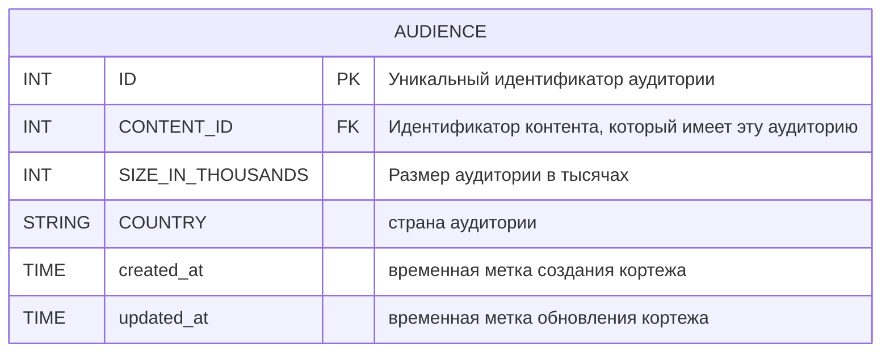
## Таблица AUDIENCE

Таблица `COUNTRY` содержит информацию о странах, в которых был снят/произведен контент.
<p> Функциональные зависимости: </p>

- `{ID} -> {NAME}`


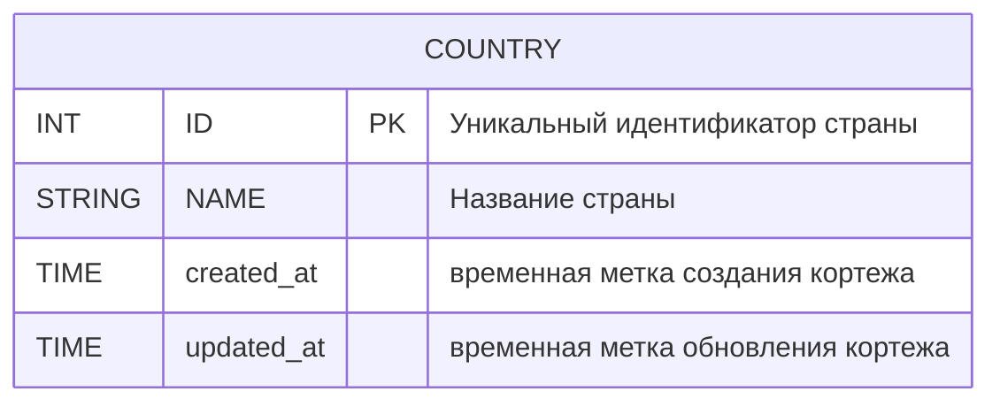
## Таблица BOXOFFICE

Таблица `BOXOFFICE` содержит информацию о кассовых сборах определенной суммы в определенной стране.
У одного контента может быть несколько кассовых сборов в разных странах.
<p> Функциональные зависимости: </p>

- `{ID} -> {CONTENT_ID, COUNTRY, REVENUE, created_at, updated_at}`
- `{CONTENT_ID} -> CONTENT {ID}`

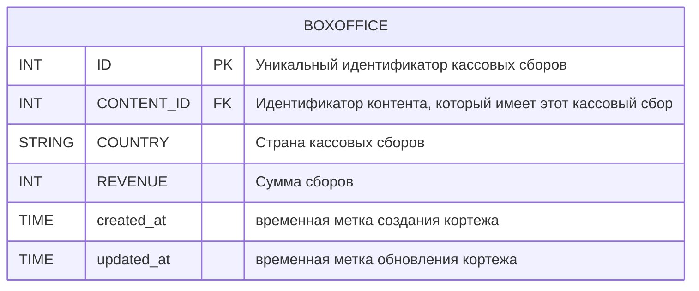

## Таблица GENRE

Таблица `GENRE` содержит информацию о жанрах контента на русском и английском языках.
<p> Функциональные зависимости: </p>

- `{ID} -> {NAME, NAME_RU, created_at, updated_at}`

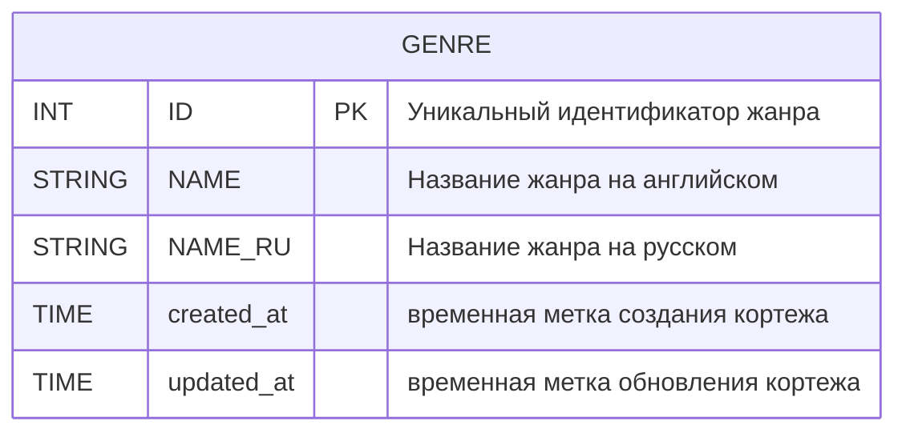

## Таблица BIRTHPLACE

Таблица `BIRTHPLACE` содержит информацию о месте рождения персоны.
<p> Функциональные зависимости: </p>

- `{ID} -> {CITY, REGION, COUNTRY, created_at, updated_at}`

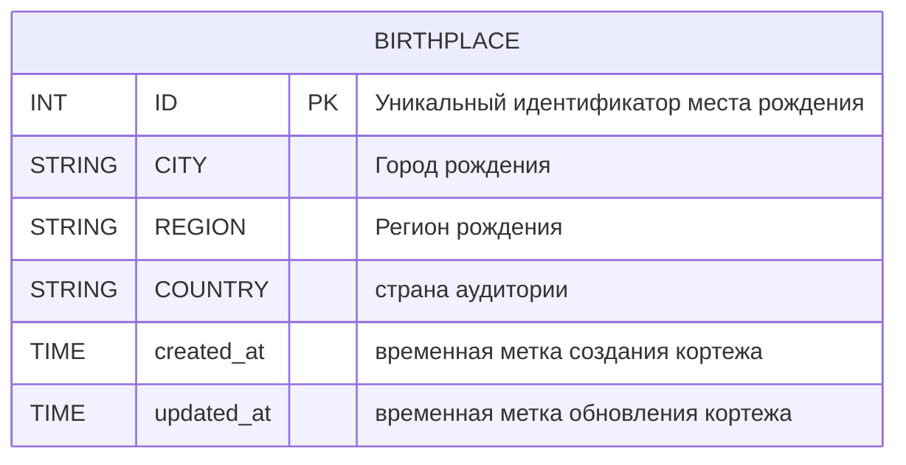

## Таблица PERSON

Таблица `PERSON` содержит информацию о персонах, которые участвовали в создании контента.
<p> Функциональные зависимости: </p>

- `{ID} -> {FIRST_NAME, LAST_NAME, BIRTH_DATE, BIRTHPLACE_ID, DEATH_DATE, START_CAREER, END_СAREER, PHOTO,GENGER, HEIGHT, SPOUSE, CHILDREN, created_at, updated_at}`
- `{BIRTHPLACE_ID} -> BIRTHPLACE {ID}`

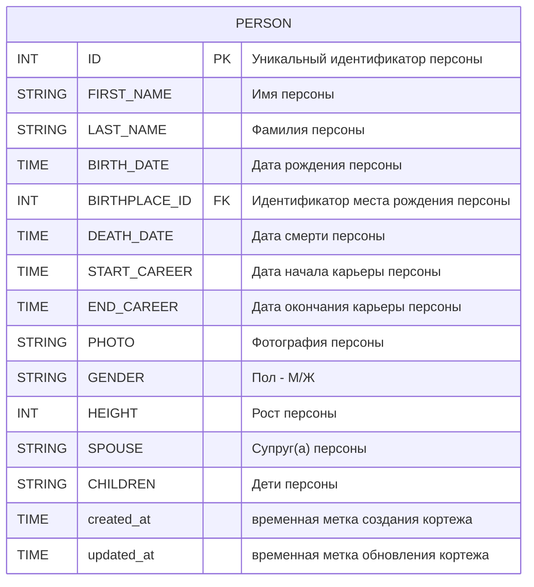

## Таблица ROLE

Таблица `ROLE` содержит информацию о ролях персоны в контенте, наприер, актер, режиссер, дублер и т.д.
<p> Функциональные зависимости: <p> 

- `{ID} -> {NAME, created_at, updated_at}`

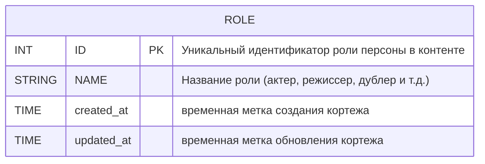

## Таблица FILM

Таблица `FILM` содержит информацию о фильмах. В фильме есть данные контента и некоторые специфичные для фильма данные.
<p> Функциональные зависимости: <p> 

- `{ID} -> {CONTENT_ID, YEAR, DURATION, created_at, updated_at}`
- `{CONTENT_ID} -> CONTENT {ID}`

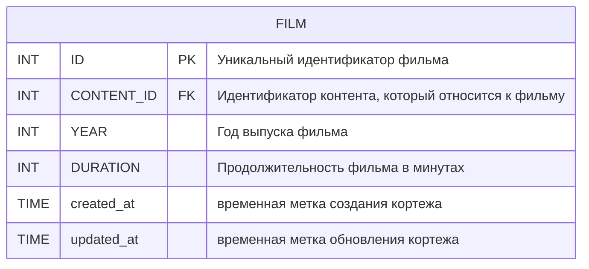

## Таблица CONTENT

Таблица `CONTENT` содержит информацию о контенте, который может быть фильмом или сериалом. Контент собирает в себе общую 
информацию, которая может быть общей как для фильмов, так и для сериалов.
<p> Функциональные зависимости: <p> 

- `{ID} -> {TITLE, ORIGINAL_TITLE, BUDGET, MARKETING, PREMIERE, RELEASE, AGE_RESTRICTION, IMDB, DESCRIPTION, POSTER, PLAYBACK, TYPE, created_at, updated_at}`

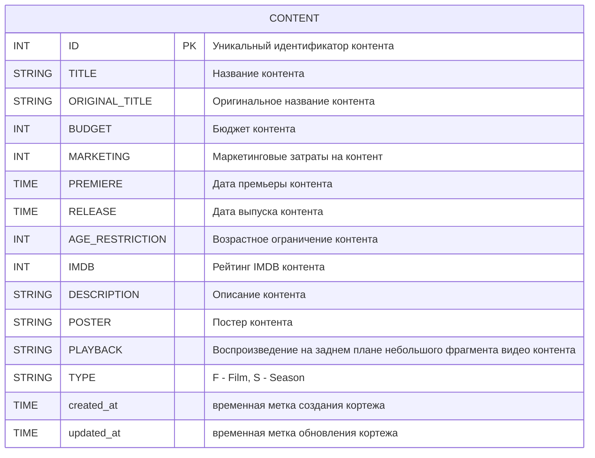

## Таблица STATUS

Таблица `STATUS` содержит информацию о статусе контента у пользователя. Статус может быть просмотрен, запланирован, пересматривается, добавлен в избранное.
<p> Функциональные зависимости: <p> 

- `{ID} -> {STATUS, created_at, updated_at}`

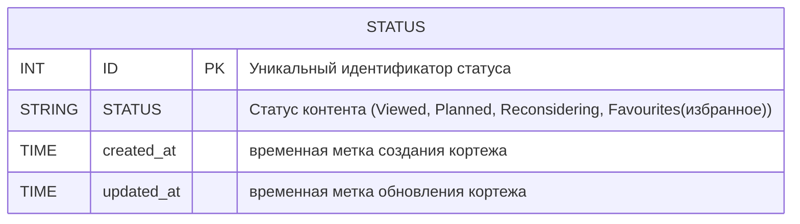

## Таблица EPISODE

Таблица `EPISODE` содержит информацию об эпизодах сериала. В сезоне может быть несколько эпизодов.
<p> Функциональные зависимости: <p> 

- `{ID} -> {SEASON_ID, DESCRIPTION, EPISODE_NUMBER, created_at, updated_at}`
- `{SEASON_ID} -> SEASON {ID}`

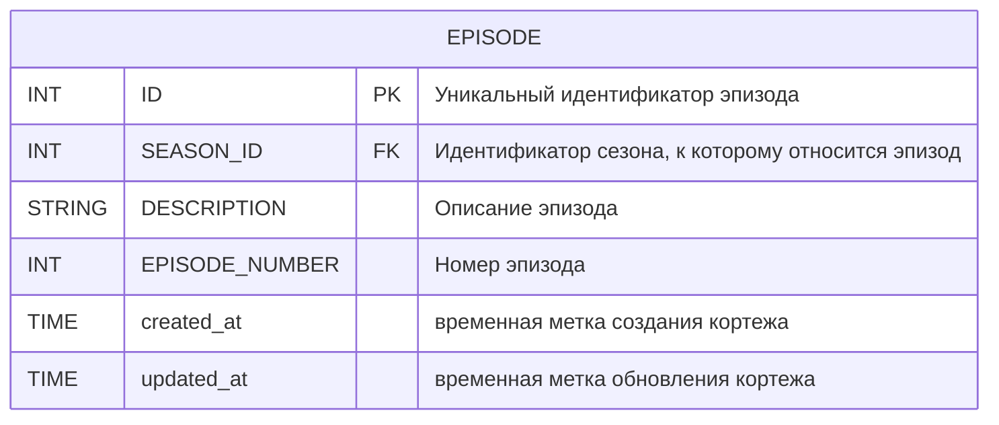

## Таблица SEASON

Таблица `SEASON` содержит информацию о сезонах сериала. В сериале может быть несколько сезонов. В сезоне есть данные контента 
и некоторые специфичные для сезона данные (год начала, год окончания, количество эпизодов).
<p> Функциональные зависимости: <p> 

- `{ID} -> {CONTENT_ID, SERIES_ID, YEAR_START, YEAR_END, COUNT_EPISODES, created_at, updated_at}`
- `{CONTENT_ID} -> CONTENT {ID}`
- `{SERIES_ID} -> SERIES {ID}`

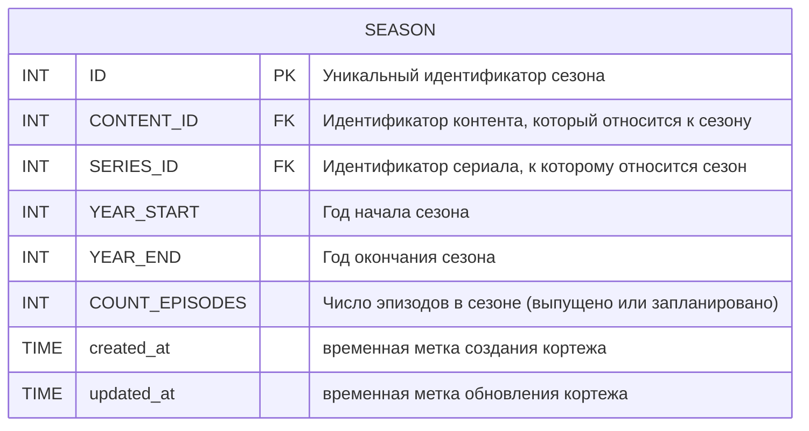

## Таблица SERIES

Таблица `SERIES` содержит информацию о сериалах.
<p> Функциональные зависимости: <p> 

- `{ID} -> {TITLE, YEAR_START, YEAR_END, created_at, updated_at}`

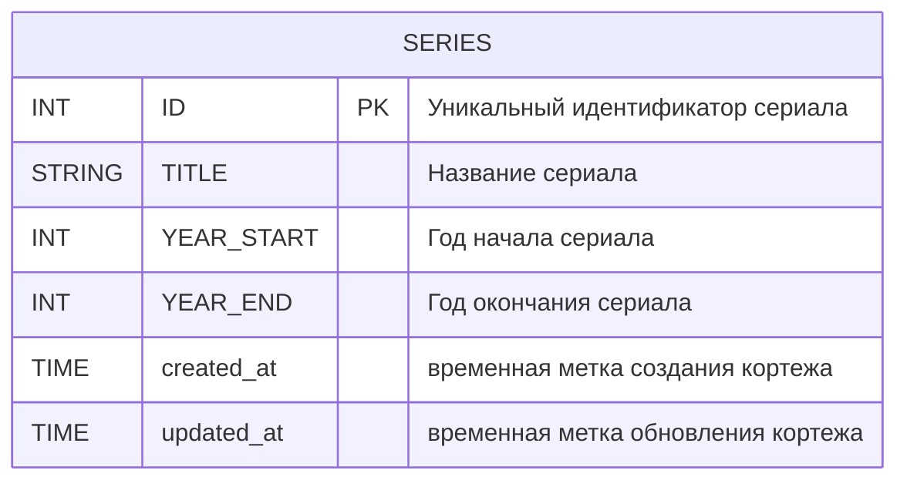

## Таблица USER

Таблица `USER` содержит информацию о пользователях. Пользователь может оставлять комментарии, ставить оценки, сохранять контент и персон.
<p> Функциональные зависимости: <p> 

- `{ID} -> {NAME, EMAIL, PASSWORD_HASHED, SALT_PASSWORD, BIRTH_DATE, DATE_REGISTERED, created_at, updated_at}`
- `{EMAIL} -> {NAME, PASSWORD_HASHED, SALT_PASSWORD, BIRTH_DATE, DATE_REGISTERED, created_at, updated_at}`

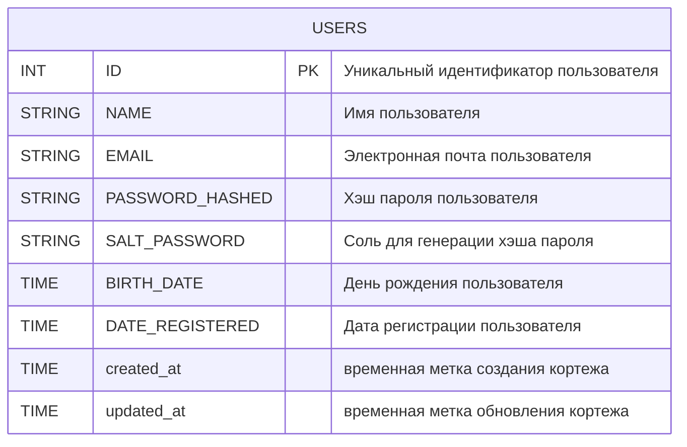

## Таблица COMMENT

Таблица `COMMENT` содержит информацию о комментариях пользователей к контенту. Комментарий содержит заголовок, текст, оценку контента пользователем, 
оставившим комментарий.
<p> Функциональные зависимости: <p> 

- `{ID} -> {USER_ID, CONTENT_ID, TITLE, TEXT, RATING_USER, created_at, updated_at}`
- `{USER_ID} -> USER {ID}`
- `{CONTENT_ID} -> CONTENT {ID}`

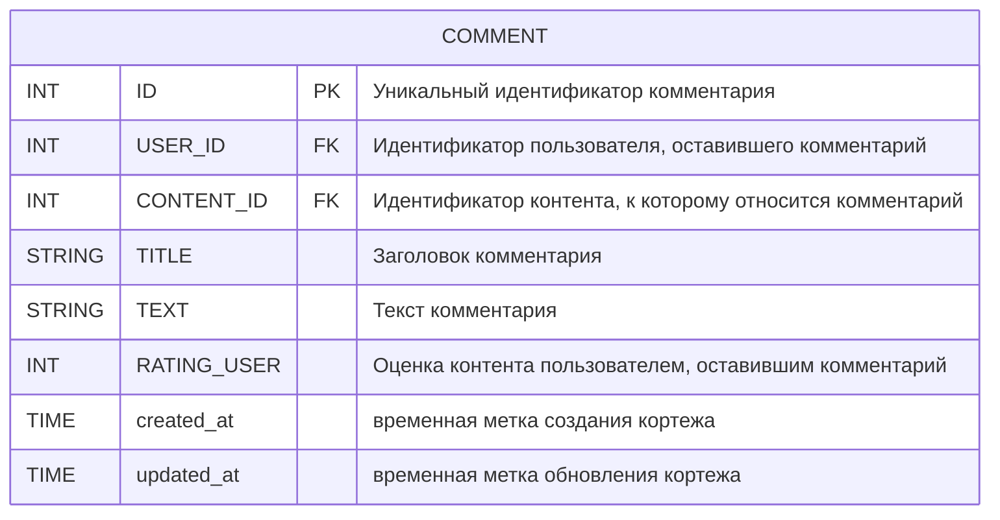

## Таблица NOMINATION

Таблица `NOMINATION` содержит информацию о номинациях. У награды может быть несколько номинаций. 
Номинацию получают либо персона (за контент), либо контент.
<p> Функциональные зависимости: <p> 

- `{ID} -> {TITLE, CONTENT_ID, PERSON_ID, AWARD_ID, created_at, updated_at}`
- `{CONTENT_ID} -> CONTENT {ID}`
- `{PERSON_ID} -> PERSON {ID}`
- `{AWARD_ID} -> AWARD {ID}`

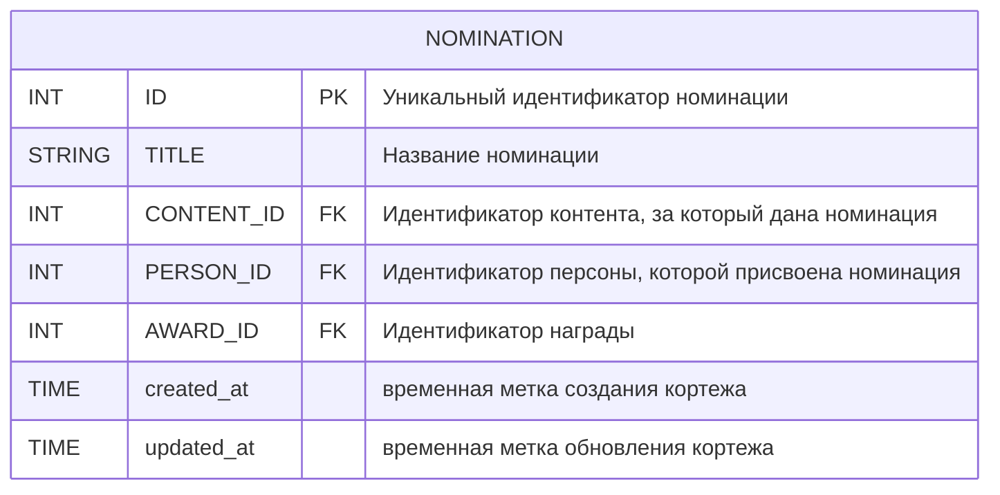

## Таблица AWARD

Таблица `AWARD` содержит информацию о наградах. 
<p> Функциональные зависимости: <p> 

- `{ID} -> {YEAR, NAME, created_at, updated_at}`

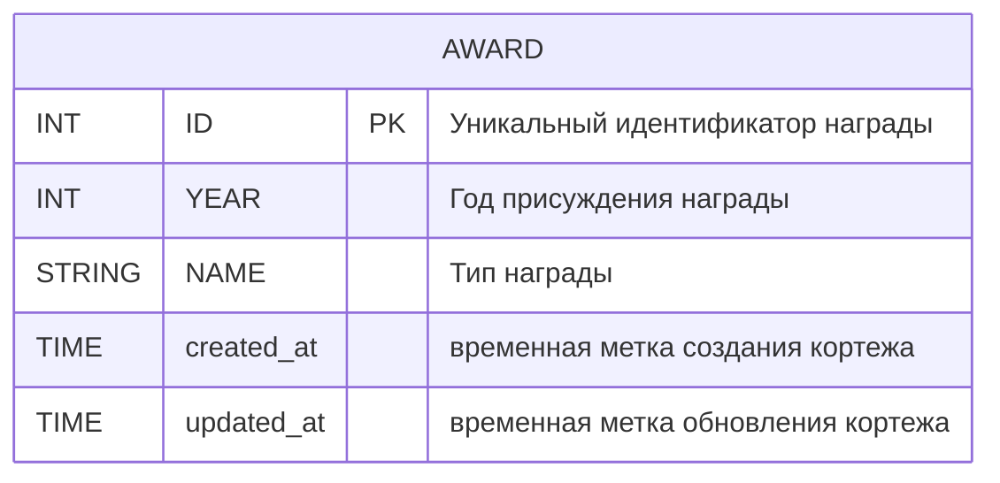

## Таблица RATING

Таблица `RATING` содержит информацию о рейтингах контента и персон.
<p> Функциональные зависимости: <p> 

- `{ID} -> {USER_ID, VALUE, TYPE, created_at, updated_at}`
- `{USER_ID} -> USER {ID}`

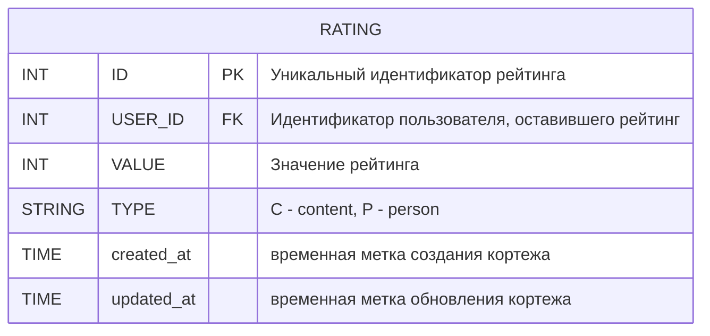

# Вспомогательные таблицы

## Таблица RATING_TYPE

Таблица `RATING_TYPE` содержит информацию о типах рейтингов. Рейтинг может быть оставлен пользователем контенту или персоне.
Таблица реализует связь между рейтингом и контентом/персоной.
<p> Функциональные зависимости: <p> 

- `{RATING_ID} -> RATING {ID}`
- `{ENTITY_ID} -> CONTENT {ID} + PERSON {ID}`

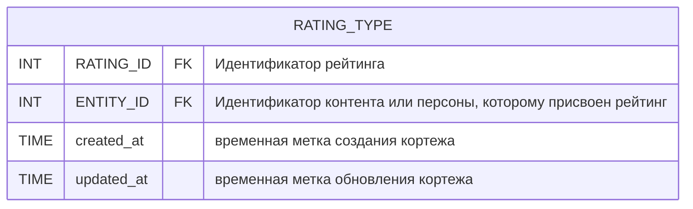

## Таблица COMMENT_LIKES

Таблица `COMMENT_LIKES` содержит информацию о лайках/дизлайках комментариев. Она реализует связь между комментарием и пользователем, 
который оценил чужой комментарий.
<p> Функциональные зависимости: <p> 

- `{COMMENT_ID} -> COMMENT {ID}`
- `{USER_ID} -> USER {ID}`
- `{COMMENT_ID, USER_ID} -> {VALUE, created_at, updated_at}`

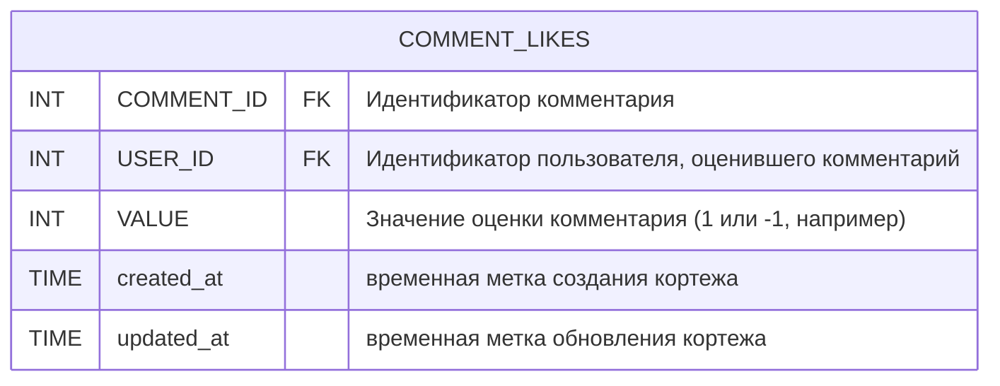

## Таблица SAVED_PERSON

Таблица `SAVED_PERSON` содержит информацию о персонах, которые были сохранены пользователем. Она реализует связь М:N между пользователями и персонами.
<p> Функциональные зависимости: <p> 

- `{PERSON_ID} -> PERSON {ID}`
- `{USER_ID} -> USER {ID}`
- `{PERSON_ID, USER_ID} -> {created_at, updated_at}`

```mermaid
erDiagram
    SAVED_PERSON{
        INT PERSON_ID FK "Идентификатор сохраненного персону"
        INT USER_ID FK "Идентификатор пользователя, сохранившего персону"
        TIME created_at "временная метка создания кортежа"
        TIME updated_at "временная метка обновления кортежа"
    }
```

## Таблица SAVED_CONTENT

Таблица `SAVED_CONTENT` содержит информацию о контенте, которому пользователем был поставлен определенный статус.
Она реализует связь М:N между пользователями и контентом.
<p> Функциональные зависимости: <p> 

- `{CONTENT_ID} -> CONTENT {ID}`
- `{USER_ID} -> USER {ID}`
- `{STATUS_ID} -> STATUS {ID}`
- `{CONTENT_ID, USER_ID, STATUS_ID} -> {created_at, updated_at}`

```mermaid
erDiagram
    CONTENT_STATUS{
        INT CONTENT_ID FK "Идентификатор контента"
        INT USER_ID FK "Идентификатор пользователя"
        INT STATUS_ID FK "Статус контента (Viewed, Planned, Reconsidering, Favourites(избранное))"
        TIME created_at "временная метка создания кортежа"
        TIME updated_at "временная метка обновления кортежа"
    }
```

## Таблица GENRE_CONTENT

Таблица `GENRE_CONTENT` реализует связь М:N между контентом и жанрами.
<p> Функциональные зависимости: <p> 

- `{GENRE_ID} -> GENRE {ID}`
- `{CONTENT_ID} -> CONTENT {ID}`
- `{GENRE_ID, CONTENT_ID} -> {created_at, updated_at}`

```mermaid
erDiagram
    GENRE_CONTENT{
        INT GENRE_ID FK "Идентификатор жанра"
        INT CONTENT_ID FK "Идентификатор контента"
        TIME created_at "временная метка создания кортежа"
        TIME updated_at "временная метка обновления кортежа"
    }
```

## Таблица COUNTRY_CONTENT

Таблица `COUNTRY_CONTENT` реализует связь М:N между контентом и странами.
<p> Функциональные зависимости: <p> 

- `{COUNTRY_ID} -> COUNTRY {ID}`
- `{CONTENT_ID} -> CONTENT {ID}`
- `{COUNTRY_ID, CONTENT_ID} -> {created_at, updated_at}`

```mermaid
erDiagram
    COUNTRY_CONTENT{
        INT COUNTRY_ID FK "Идентификатор страны"
        INT CONTENT_ID FK "Идентификатор контента"
        TIME created_at "временная метка создания кортежа"
        TIME updated_at "временная метка обновления кортежа"
    }
```

## Таблица PERSON_ROLE

Таблица `PERSON_ROLE` реализует связь М:N между персонами и ролями в контенте. У одной персоны может быть несколько ролей в разных контентах.
<p> Функциональные зависимости: <p> 

- `{PERSON_ID} -> PERSON {ID}`
- `{ROLE_ID} -> ROLE {ID}`
- `{CONTENT_ID} -> CONTENT {ID}`
- `{PERSON_ID, ROLE_ID, CONTENT_ID} -> {created_at, updated_at}`

```mermaid
erDiagram
    CONTENT_PERSON{
        INT CONTENT_ID FK "Идентификатор контента"
        INT PERSON_ID FK "Идентификатор персоны"
        INT ROLE_ID FK "Роль персоны в контенте"
        TIME created_at "временная метка создания кортежа"
        TIME updated_at "временная метка обновления кортежа"
    }
```