## Таблица STATIC

Таблица `STATIC` содержит информацию о статических данных, таких как изображения, которые загружаются на сайт. 
Это могут быть аватары пользователей, постеры контента и т.д.

 Функциональные зависимости: 

- `{id} -> {name, path, created_at}`

 Нормальные формы: 

- 1 НФ: Атрибуты id, name, path, created_at являются атомарными.
- 2 НФ: Атрибуты name, path, created_at полностью функционально зависят от первичного ключа id.
- 3 НФ: Атрибуты name, path, created_at не зависят от других атрибутов.
- НФБК: 3 НФ + в таблице отсутствуют составные ключи.

## Таблица COUNTRY

Таблица `COUNTRY` содержит информацию о странах.

 Функциональные зависимости: 

- `{id} -> {name}`

 Нормальные формы: 

- 1 НФ: Атрибуты id, name являются атомарными.
- 2 НФ: Атрибут name полностью функционально зависит от первичного ключа id.
- 3 НФ: Атрибут name не зависит от других атрибутов.
- НФБК: 3 НФ + в таблице отсутствуют составные ключи.

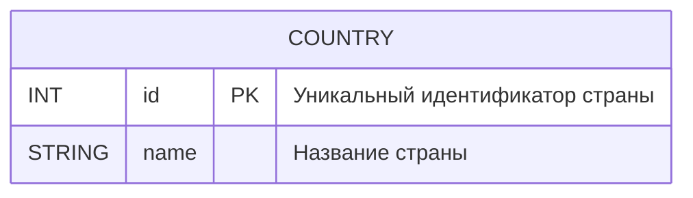

## Таблица GENRE

Таблица `GENRE` содержит информацию о жанрах контента.

 Функциональные зависимости: 

- `{id} -> {name}`

 Нормальные формы: 

- 1 НФ: Атрибуты id, name являются атомарными.
- 2 НФ: Атрибут name полностью функционально зависит от первичного ключа id.
- 3 НФ: Атрибут name не зависит от других атрибутов.
- НФБК: 3 НФ + в таблице отсутствуют составные ключи.

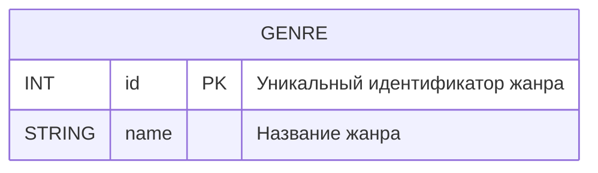

## Таблица PERSON

Таблица `PERSON` содержит информацию о персонах, участвующих в создании контента.

 Функциональные зависимости: 

- `{id} -> {first_name, last_name, birth_date, death_date, start_career, end_career, sex, height, spouse, children, photo_upload_id, created_at, updated_at}`

 Нормальные формы: 

- 1 НФ: Все атрибуты являются атомарными.
- 2 НФ: Все атрибуты полностью функционально зависят от первичного ключа id.
- 3 НФ: Все атрибуты не зависят от других атрибутов.
- НФБК: 3 НФ + в таблице отсутствуют составные ключи.

## Таблица CONTENT

Таблица `CONTENT` содержит информацию о контенте.

 Функциональные зависимости: 

- `{id} -> {title, original_title, slogan, budget, age_restriction, audience, imdb, description, poster_upload_id, box_office, marketing_budget, created_at, updated_at}`

 Нормальные формы: 

- 1 НФ: Все атрибуты являются атомарными.
- 2 НФ: Все атрибуты полностью функционально зависят от первичного ключа id.
- 3 НФ: Все атрибуты не зависят от других атрибутов.
- НФБК: 3 НФ + в таблице отсутствуют составные ключи.

## Таблица ROLES

Таблица `ROLES` содержит информацию о ролях персон в контенте. Например, актер, режиссер, продюсер и т.д.

 Функциональные зависимости: 

- `{id} -> {name}`

 Нормальные формы: 

- 1 НФ: Атрибуты id, name являются атомарными.
- 2 НФ: Атрибут name полностью функционально зависит от первичного ключа id.
- 3 НФ: Атрибут name не зависит от других атрибутов.
- НФБК: 3 НФ + в таблице отсутствуют составные ключи.

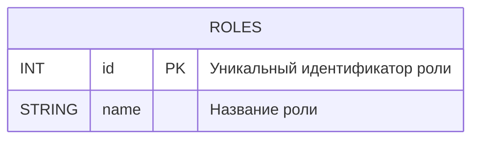

## Таблица USERS

Таблица `USERS` содержит информацию о пользователях.

 Функциональные зависимости: 

- `{id} -> {name, email, password_hashed, salt_password, avatar_upload_id, created_at, updated_at}`

 Нормальные формы: 

- 1 НФ: Все атрибуты являются атомарными.
- 2 НФ: Все атрибуты полностью функционально зависят от первичного ключа id.
- 3 НФ: Все атрибуты не зависят от других атрибутов.
- НФБК: 3 НФ + в таблице отсутствуют составные ключи.

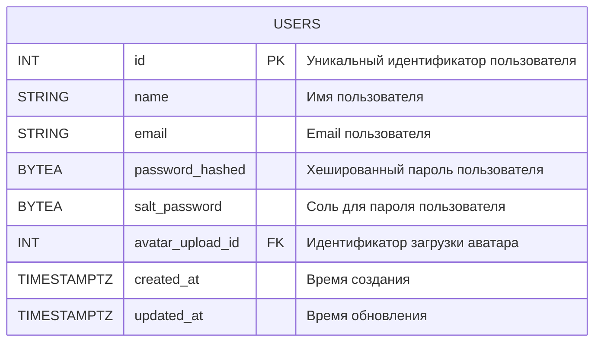

## Таблица REVIEW

Таблица `REVIEW` содержит информацию о ревью на контент, которые делают пользователи.

 Функциональные зависимости: 

- `{id} -> {user_id, content_id, title, text, content_rating, created_at, updated_at}`

 Нормальные формы: 

- 1 НФ: Все атрибуты являются атомарными.
- 2 НФ: Все атрибуты полностью функционально зависят от первичного ключа id.
- 3 НФ: Все атрибуты не зависят от других атрибутов.
- НФБК: 3 НФ + в таблице отсутствуют составные ключи.

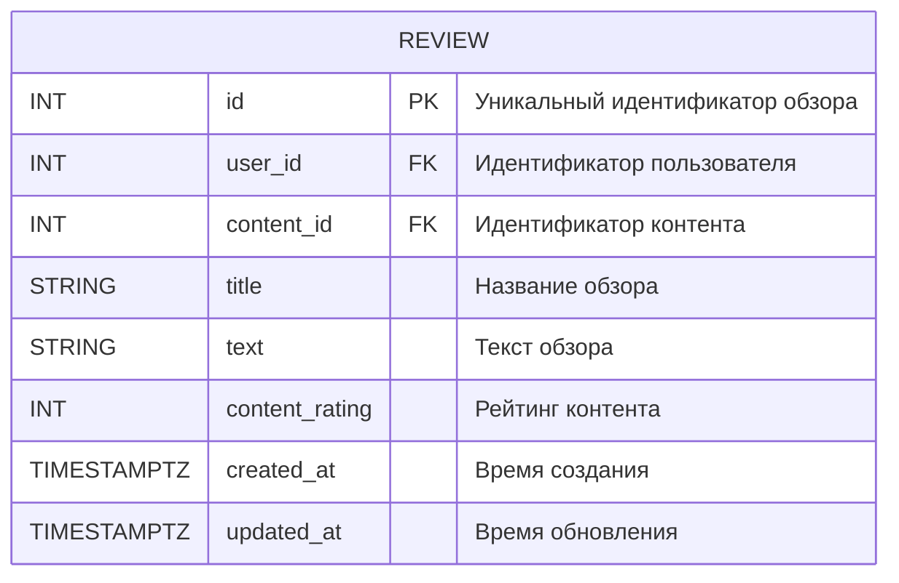

## Таблица COMPILATION_TYPE

Таблица `COMPILATION_TYPE` содержит информацию о типах подборок контента. Например, годы, фильмы, сериалы и т.д.

 Функциональные зависимости: 

- `{id} -> {type}`

 Нормальные формы: 

- 1 НФ: Атрибуты id, type являются атомарными.
- 2 НФ: Атрибут type полностью функционально зависит от первичного ключа id.
- 3 НФ: Атрибут type не зависит от других атрибутов.
- НФБК: 3 НФ + в таблице отсутствуют составные ключи.

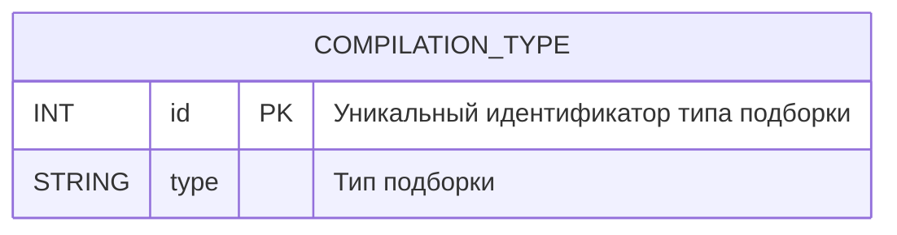

## Таблица COMPILATION

Таблица `COMPILATION` содержит информацию о подборках контента. Например, подборка лучших фильмов 2021 года.

 Функциональные зависимости: 

- `{id} -> {title, compilation_type_id, poster_upload_id}`

 Нормальные формы: 

- 1 НФ: Все атрибуты являются атомарными.
- 2 НФ: Все атрибуты полностью функционально зависят от первичного ключа id.
- 3 НФ: Все атрибуты не зависят от других атрибутов.
- НФБК: 3 НФ + в таблице отсутствуют составные ключи.

## Таблица COMPILATION_CONTENT

Таблица `COMPILATION_CONTENT` содержит информацию о связи между подборками и контентом.

 Функциональные зависимости: 

- `{compilation_id, content_id} -> {}`

 Нормальные формы: 

- 1 НФ: Все атрибуты являются атомарными.
- 2 НФ: Нет атрибутов, которые зависят от части составного ключа.
- 3 НФ: Нет атрибутов, которые зависят от других атрибутов.
- НФБК: 3 НФ + в таблице отсутствуют транзитивные зависимости.

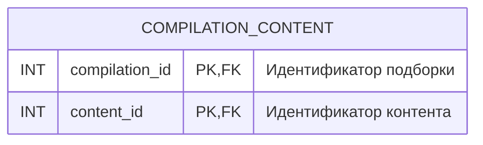

## Таблица REVIEW_LIKE

Таблица `REVIEW_LIKE` содержит информацию о лайках, которые пользователи ставят ревью.

 Функциональные зависимости: 

- `{review_id, user_id} -> {value, updated_at}`

 Нормальные формы: 

- 1 НФ: Все атрибуты являются атомарными.
- 2 НФ: Атрибуты value, updated_at полностью функционально зависят от составного ключа {review_id, user_id}.
- 3 НФ: Атрибуты value, updated_at не зависят от других атрибутов.
- НФБК: 3 НФ + в таблице отсутствуют транзитивные зависимости.

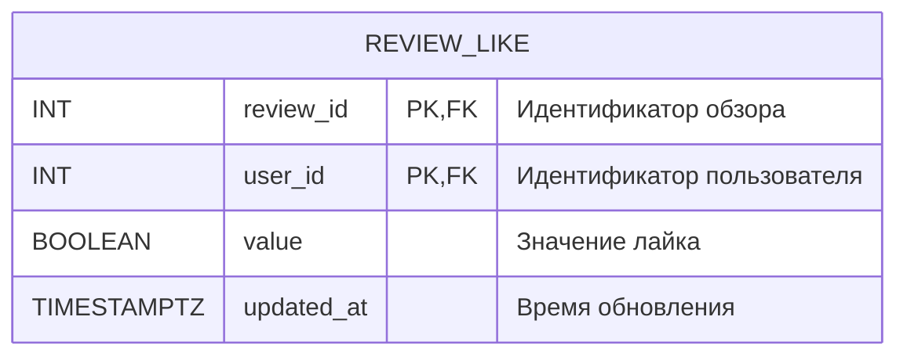

## Таблица GENRE_CONTENT

Таблица `GENRE_CONTENT` содержит информацию о связи между жанрами и контентом.

 Функциональные зависимости: 

- `{genre_id, content_id} -> {}`

 Нормальные формы: 

- 1 НФ: Все атрибуты являются атомарными.
- 2 НФ: Нет атрибутов, которые зависят от части составного ключа.
- 3 НФ: Нет атрибутов, которые зависят от других атрибутов.
- НФБК: 3 НФ + в таблице отсутствуют транзитивные зависимости.

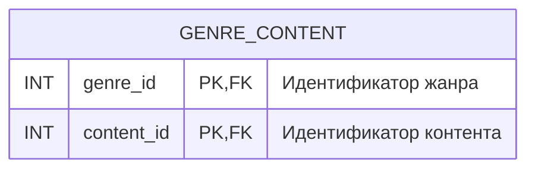

## Таблица COUNTRY_CONTENT

Таблица `COUNTRY_CONTENT` содержит информацию о связи между странами и контентом.

 Функциональные зависимости: 

- `{country_id, content_id} -> {}`

 Нормальные формы: 

- 1 НФ: Все атрибуты являются атомарными.
- 2 НФ: Нет атрибутов, которые зависят от части составного ключа.
- 3 НФ: Нет атрибутов, которые зависят от других атрибутов.
- НФБК: 3 НФ + в таблице отсутствуют транзитивные зависимости.

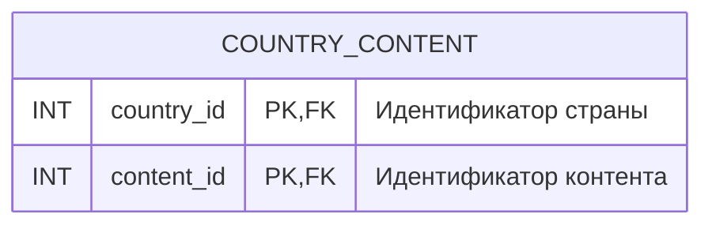

## Таблица CONTENT_TYPE

Таблица `CONTENT_TYPE` содержит информацию о типах контента: фильм, сериал.

 Функциональные зависимости: 

- `{id} -> {content_id, type}`

 Нормальные формы: 

- 1 НФ: Все атрибуты являются атомарными.
- 2 НФ: Все атрибуты полностью функционально зависят от первичного ключа id.
- 3 НФ: Все атрибуты не зависят от других атрибутов.
- НФБК: 3 НФ + в таблице отсутствуют составные ключи.

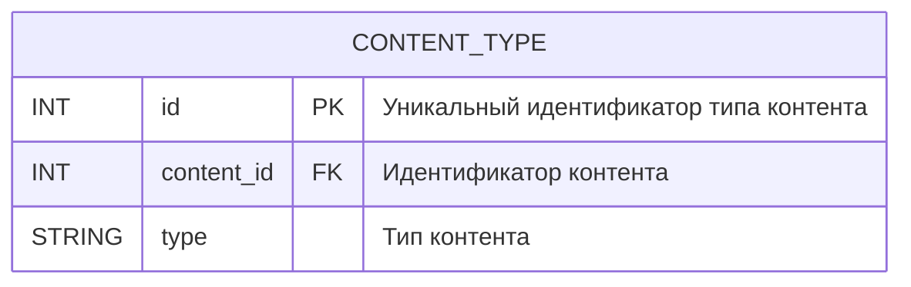