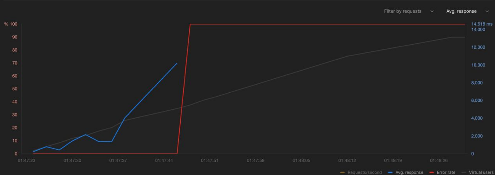

Тестирование и оптимизация

# Тестирование

## До оптимизации

Перед проведением оптимизации, мы столкнулись с ограничением производительности при добавлении сущностей. 
Согласно отчету (см. report-1), система могла обрабатывать только 20-30 запросов на добавление пользователей 
в секунду. Это можно увидеть на графике пропускной способности 1.2. 

## Добавление 100 000 сущностей

При проведении тестирования на добавление 100 пользователей в секунду, мы столкнулись с проблемами. Система не смогла справиться с такой нагрузкой, 
что привело к возникновению ошибок, как видно на представленном ниже скриншоте.

 

## Оптимизация

Для добавления 100 000 сущностей мы рассмотрели пути оптимизации:

- Криптография. Криптография при регистрации пользователя занимает много времени. Мы использовали алгоритм Argon2 для создания хэша пароля. 
- Валидация email. Мы использовали регулярное выражение для валидации email. Оно компилировалось на каждую попытку валидации.

В БД путей оптимизации мы не нашли.

## После оптимизации

После оптимизации мы смогли увеличить пропускную способность системы (см. report-2). В отчете в статистике есть ошибки
при добавлении 100 000 сущностей. Они связаны с генерацией данных (Error 409 Conflict), то есть иногда
генерировались одинаковые email.

# Получение сущностей

В отчете report-3 видно, что получение нет смысла оптимизировать, так как оно происходит мгновенно.